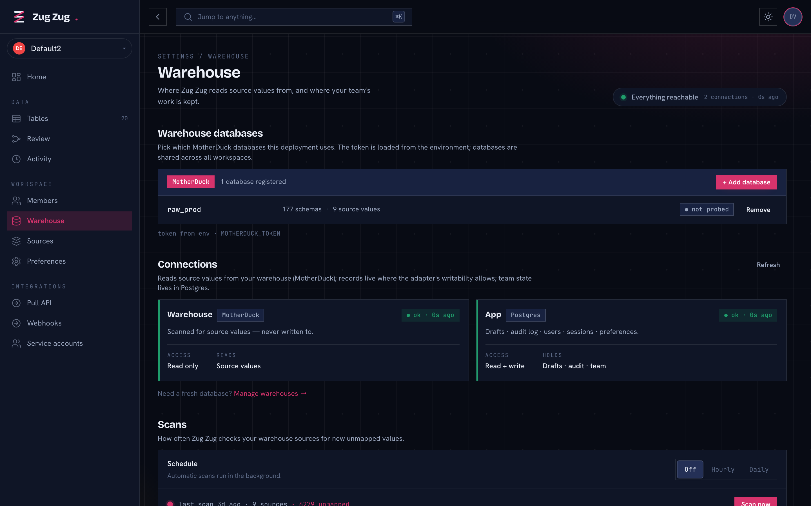
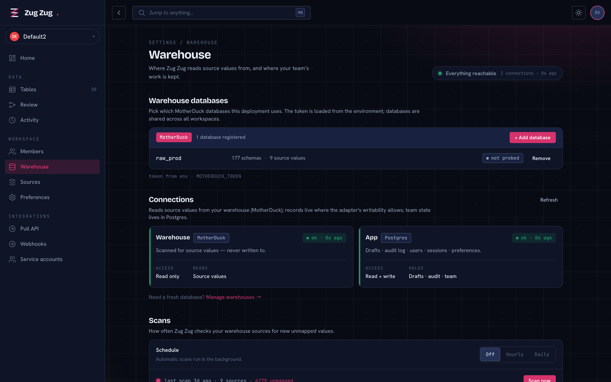
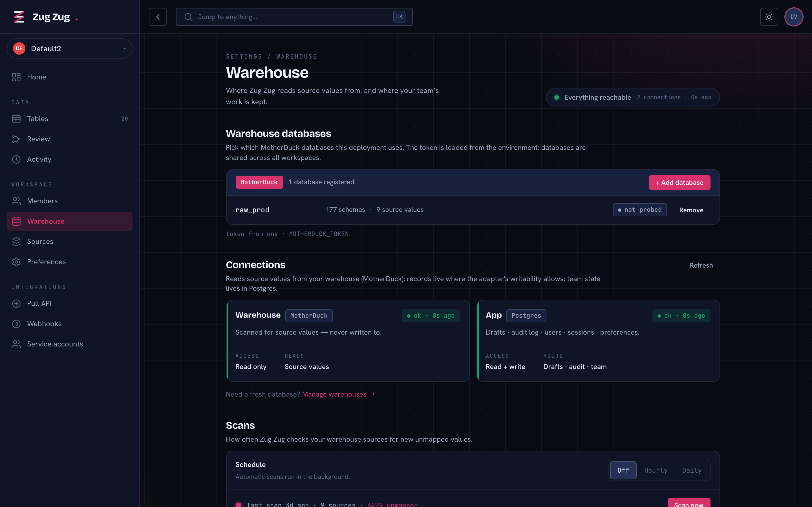
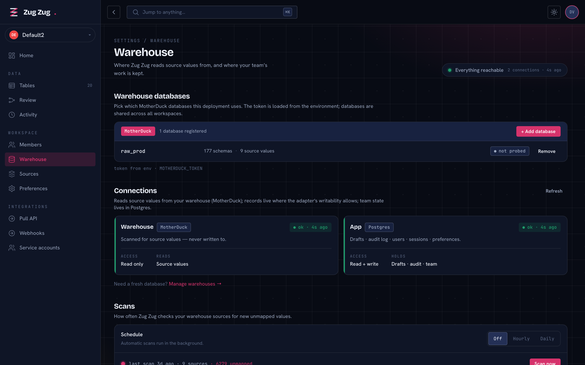
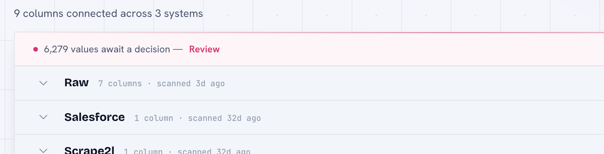
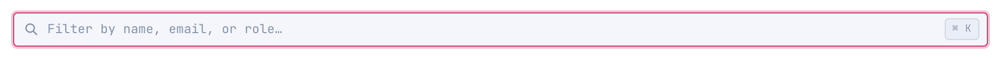
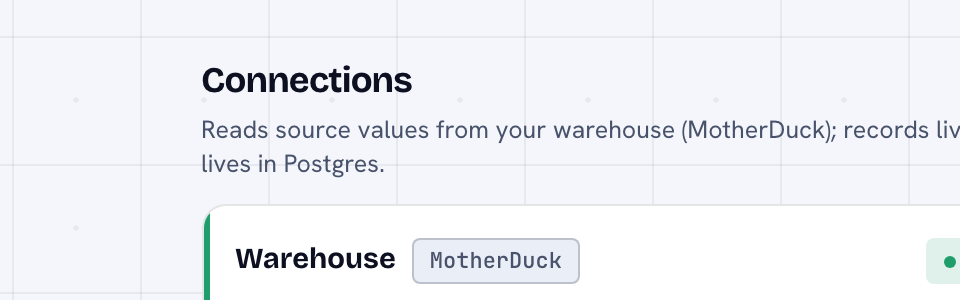
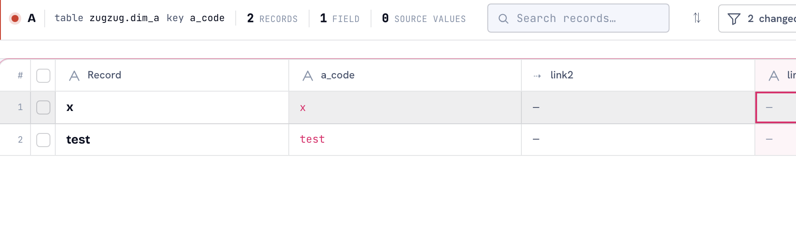
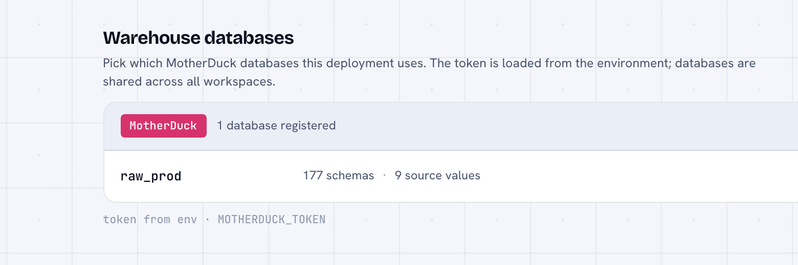
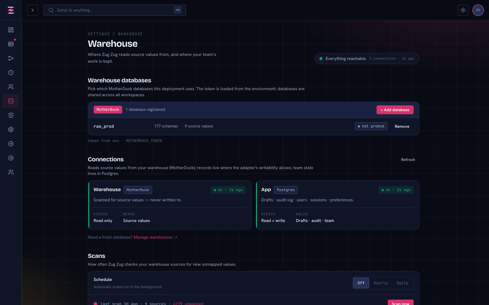

# Rounded + Narrow — Findings

Investigation of whether Zugzug should adopt the `warehouse-redesign.html` look:
**rounded corners app-wide** + a **narrow, framed document column**. Built as a
throwaway spike on top of the current `polish` branch (square-mode commented
out, a `--doc` width token added, settings pages routed through it), captured
with Playwright/headless-chromium against the live app + real shell (real
sidebar, 60px topbar, real Postgres data). All screenshots in
`./findings-assets/`.

---

## 1. Go / No-Go

**GO.** Rounded + narrow looks good in the real shell — dark and light, desktop
and mobile, sidebar expanded and collapsed. The narrow column reads as an
intentional framed document instead of the current stretched-to-1320 sheet, and
restoring the `4/8/12` radius scale is clean everywhere it matters. The risks
found are all containable (one `fix-during-rollout`, the rest cosmetic) — none
is a blocker.

Most decisive shot — the same Warehouse page, before vs. after:

| Before (live: square, `--wide` 1320) | After (spike: rounded, `--doc` 1040) |
| --- | --- |
|  |  |

The "after" frames the content, softens every surface, and keeps the sidebar
relationship intact. The connection cards drop from a stretched near-full-width
row to a comfortable 2-up. This is the change the user is reacting to, and it
holds up in the mounted shell.

---

## 2. Recommended `--doc` width: **1040px**

Shoot-out on the Warehouse page (the 2-up connection-card page), desktop dark,
sidebar expanded:

| 940 | 1040 | 1180 |
| --- | --- | --- |
|  |  |  |

Justification shot: **`03-width-1040-dark.png`**.

- **940** — connection cards are a tight-but-fine 2-up; the hint paragraphs wrap
  to a genuinely short measure. It reads well but starts to feel *narrow* for
  the denser pages (Members' 3-up role cards and the member table get cramped),
  and it leaves a wide dead margin on the right at 1440.
- **1180** — the column nearly fills the usable area (1440 − ~230 sidebar ≈ 1210
  usable), so the frame almost disappears — the "un-framed" failure the user is
  trying to escape. Hint lines like *"Reads source values from your warehouse
  (MotherDuck); records live where the adapter's writability allows; team state
  lives in Postgres"* run as one long line. This is barely different from the
  1320 baseline.
- **1040** — best balance. Connection cards sit as a comfortable 2-up, Members'
  3-up role cards fit without crowding (`05-members-1040-dark.png`), no real
  settings table overflows, hint text keeps a readable ~2-line measure, and the
  right margin still visibly frames the column against the lattice. It is close
  to the demo's 940 feel but survives the app's denser real pages, which the
  demo never had to.

Verified at 1040 across: light (`04-warehouse-1040-light.png`), Members
(`05-members-1040-dark.png`), Mapping/2-col (`06-mapping-1040-dark.png`),
mobile (`08`, `09`) — all clean.

---

## 3. Ranked risk list (rollout step-3 work queue)

Severity: **blocker** / **fix-during-rollout** / **cosmetic**.

### R1 — Sources / Triage bespoke surfaces are inconsistently rounded — `fix-during-rollout`
The full-bleed grid surfaces don't share one class. **Triage** already uses
`rounded-lg` (`Triage.tsx:422`, `:68`) so it rounds correctly once square-mode
is off (`11-grid-triage-rounded-dark.png` — full-bleed *and* rounded, the target
look). **Sources** uses `overflow-hidden border ... shadow-pop` with **no
`rounded-lg`** (`Sources.tsx:274`, and its loader at `:49` *does* have it), so
its surface stays a hard 90° box while every sibling rounds — reads as an
oversight.
Evidence: 
(hard top-left corner + straight accent hairline).
Fix sketch: add `rounded-lg` to `Sources.tsx:274` (match `Triage.tsx:422`). Grep
for full-bleed surfaces using `overflow-hidden border` without a `rounded-*` and
normalize.

### R2 — Global `:focus-visible` ring radius is pinned to `--r-sm` (4px) — `cosmetic`
`globals.css:305` sets the shared focus outline's `border-radius:
var(--r-sm)` = 4px. Under square-mode every element and the ring were 0px, so it
matched. With radii restored, larger elements (buttons/inputs at `--r` 8px,
cards at `--r-lg` 12px) get a focus ring whose corners are *tighter* (4px) than
the element they wrap — a slight pinch at each corner.
Evidence: 
(ring corners a hair boxier than the 8px input). Legible and accessible — purely
aesthetic.
Fix sketch: either bump the shared ring to `--r` (8px), or let elements set
their own focus radius. Low effort; do during rollout polish.

### R3 — Connection-card left spine meets the rounded corner "colorless" — `cosmetic`
The `w-[3px]` health spine (`Warehouse.tsx:186`, absolute inset-y-0 left-0) is a
straight vertical bar; the card's `overflow-hidden rounded-lg` correctly clips
it (**no poke-out — this is the good outcome**), but that means the top/bottom
rounded arc has no spine color for ~3px.
Evidence: .
Fix sketch: none required. If desired, inset the spine `top-2 bottom-2 rounded`
so it reads as a pill rather than a clipped bar. Optional.

### R4 — Selected-cell ring is a hardcoded 2px radius over now-rounded chrome — `cosmetic`
The grid selection overlay is `rounded-[2px] border-[2px] border-accent`
(`DataGrid.tsx:117`) — a fixed 2px radius that ignores the token scale. On the
(correctly still-square) data cells it reads fine as a crisp near-square ring.
Evidence:  (rightmost
cell). It only looks slightly off *because* it doesn't move with the scale — not
a break.
Fix sketch: leave as-is (cells are square by design), or switch `2px` → `var(--r-sm)`
for consistency. Cosmetic.

### R5 — `Panel` overflow-clip on rounded frames — **verified OK, not a risk**
The classic square→round regression (a full-bleed table/header bleeding past a
rounded parent corner) **does not occur**. `Panel` and the hand-rolled framed
containers pair `overflow-hidden` with `rounded-lg`, so the `--surface-2` header
band clips to the rounded top corners cleanly.
Evidence:  (the
gray "MotherDuck · 1 database registered" band clips to the rounded top). Listed
here so the rollout can confirm rather than re-hunt. No action.

### R6 — Sticky grid header + top corners — **verified OK, not a risk**
The sticky toolbar/header (`z-10 bg-surface`, `DataGridHeader.tsx:216`) inside
the rounded Triage frame sits below the rounded top corners with no bleed
(`11-grid-triage-rounded-dark.png`). The plain full-bleed Tables grid has no
rounded outer frame at all, so there is nothing to bleed past
(`10-grid-tables-fullbleed-dark.png`). No action.

**Not observed / no issue:** badges, buttons, segmented controls (`.seg`),
search inputs, the workspace switcher, dropdowns/popovers (`rounded-sm` /
`rounded-lg` + `shadow-pop`), scrollbar, and the per-table left tint spine all
render correctly rounded with no seam artifacts across the shots.

---

## 4. Sidebar verdict (the headline question)

**Rounded + narrow looks good with the current sidebar** — this is the user's
stated unknown, and the answer is yes, with one nuance.

- **Sidebar expanded (default):** the narrow `--doc` column centers in the
  content area and frames cleanly against the lattice; the sidebar's square
  right border and the rounded content column coexist without tension
  (`02`, `04`, `05`). This is the lead look and it works.
- **Sidebar collapsed (64px rail):** because `PageContainer` uses `mx-auto`,
  the fixed-width column re-centers in the *wider* remaining space, so it drifts
  left toward the rail and leaves a larger, slightly asymmetric right margin.
  Still perfectly usable, just less balanced than expanded.
  Evidence: .
  Not a blocker; if it bothers, cap-and-left-bias or a max side padding could
  hold the column steadier when collapsed. Optional, cosmetic.
- **Mobile (sidebar → drawer):** the `--doc` cap is above the viewport width so
  content is naturally full-bleed with `p-4`; rounded surfaces read great on a
  phone (`08-mobile-warehouse-dark.png`, `09-mobile-members-light.png`).
- **Grid pages keep full-bleed identity:** Tables stays edge-to-edge and
  full-height (`10`); Triage stays full-bleed *and* full-height with the rounded
  framing (`11`). Neither becomes a narrow document. The `--doc` change is
  scoped to `PageContainer`/`SettingsLayout` and correctly never touches the
  ADR-0003 grid pages.

---

### Spike scope (discarded)
`globals.css:284-288` square-mode commented out · `--doc: 1040px` added to
`tokens.css` · `PageContainer` gained a `max="doc"` branch · `SettingsLayout`
routed through `max="doc"`. All on throwaway branch
`spike/rounded-narrow-throwaway`, discarded after capture. No product code
shipped; `polish` and its uncommitted work left intact.
